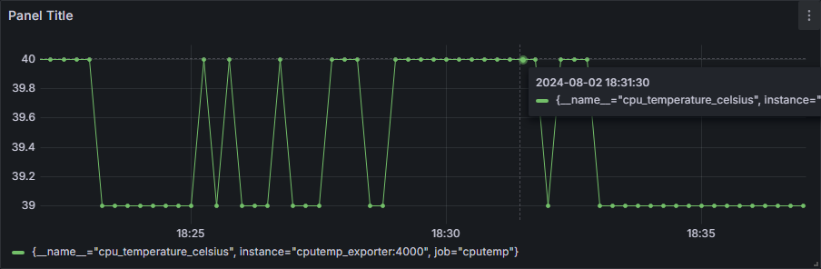

# Cpu TempExporter For Prometheus
> Goal: Cpu 온도 시계열 매트릭 수집부터 Grafana 노출까지<br>
> Prometheus [go_Client Repo](https://github.com/Monologue2/client_golang?tab=readme-ov-file) 사용법을 이해하기 위해 작성되었습니다.<br>
> 오역이 많을 수 있습니다.

### [Prometheus 용어 사전](https://prometheus.io/docs/introduction/glossary/#client-library)<br>
**Prometheus Client Library**: Go, Java, Python, Ruby 등의 언어로 작성된 라이브러리, 코드를 직접 계측하고 다른 시스템에서 메트릭을 가져오는 사용자 정의 Collecter를 작성하고 Exporter를 만드는걸 쉽게 할 수 있습니다.<br>

**Exporter**: Metric을 얻으려는 Application과 함께 실행되는 바이너리(응용 프로그램)입니다. Prometheus Metrics를 외부에 노출시키며 일반적으로 Prometheus Format이 아닌 채 외부에 노출된 데이터를(File 형태의 Log, Network 인터페이스로 전달된 Json 등) Prometheus Format으로 변환합니다.<br>

**Collector**: Exporter의 일부로서, Metrics 집합을 나타냅니다. 직접 계측의 일부인 경우 단일 Metric일 수 있으며, 다른 시스템에서 pulling 하는 방식인 경우 다수의 Metrics일 수 있습니다.<br>

**Metric** : 일반적으로 `수치를 측정한 것`. 의미합니다. `측정값` 정도로 받아들이면 되겠습니다.


## [Instrumenting a Go Application for Prometheus](https://prometheus.io/docs/guides/go-application/): Prometheus용 Go Application 구현하기
> Prometheus용 Go Application 구현하기<br>
> 개인 Application을 계측하는 경우 Prometheus Client Libaray로 코드를 계측하는 방법에 대한 규칙을 따라야한다.<br>


### Go Client_golang Library 설치
``` bash
$ go get github.com/prometheus/client_golang/prometheus
$ go get github.com/prometheus/client_golang/prometheus/promauto
$ go get github.com/prometheus/client_golang/prometheus/promhttp
```

### Go Application metric Expose하기
Prometheus Metric을 expose 하려면 `/metric` HTTP 엔드포인트를 제공해야 합니다.<br>
`prometheus/promhttp` 라이브러리의 `Hanler` 핸들러 함수를 사용할 수 있습니다. 
``` go
package main

import (
        "net/http"
        "github.com/prometheus/client_golang/prometheus/promhttp"
)

func main() {
        // http Handle 함수에 promhttp 라이브러리의 Handler를 전달하여 /metrics 엔드포인트 expose
        // `promhttp.Handler()`를 호출할 때 자동으로 Go 기본 Metrics 추가
        http.Handle("/metrics", promhttp.Handler())
        http.ListenAndServe(":2112", nil)
}
```
호출시 기본 Metrics가 반환합니다.
기본 Metrics는 `promauto` 패키지와 함께 자동으로 등록되며,<br>
`prometheus.MustRegister()` 또는 `promhttp.Handler()`를 호출할 때 자동으로 수행됩니다.
```bash
$ curl localhost:2112/metrics
# HELP go_gc_duration_seconds A summary of the pause duration of garbage collection cycles.
# TYPE go_gc_duration_seconds summary
go_gc_duration_seconds{quantile="0"} 0
go_gc_duration_seconds{quantile="0.25"} 0
go_gc_duration_seconds{quantile="0.5"} 0
go_gc_duration_seconds{quantile="0.75"} 0
go_gc_duration_seconds{quantile="1"} 0
go_gc_duration_seconds_sum 0
go_gc_duration_seconds_count 0
# HELP go_goroutines Number of goroutines that currently exist.
# TYPE go_goroutines gauge
go_goroutines 6
# HELP go_info Information about the Go environment.
# TYPE go_info gauge
go_info{version="go1.22.1"} 1
...
```
### 커스텀 Metrics 추가하기
상단의 애플리케이션은 기본 Go Metrics만 expose 합니다.<br>
애플리케이션의 커스텀 Metrics을 등록할 수 있습니다.<br>

이번 Example Application Exposes는 [Counter](https://prometheus.io/docs/concepts/metric_types/#counter) Type의 `myapp_processed_ops_total` 을 노출시킵니다. 이는 지금까지 수행한 작업의 횟수를 계산합니다.<br>
2초 마다 Counter는 1씩 증가하게 됩니다.

```go
package main

import (
	"net/http"
	"time"

	"github.com/prometheus/client_golang/prometheus"
	"github.com/prometheus/client_golang/prometheus/promauto"
	"github.com/prometheus/client_golang/prometheus/promhttp"
)

func recordMetrics() {
	go func() {
		for {
			opsProcessed.Inc()
			time.Sleep(2 * time.Second)
		}
	}()
}

var (
	opsProcessed = promauto.NewCounter(prometheus.CounterOpts{
		Name: "myapp_processed_ops_total",
		Help: "The total number of processed events",
	})
)

func main() {
	recordMetrics()

	http.Handle("/metrics", promhttp.Handler())
	http.ListenAndServe(":2112", nil)
}
```

```bash
$ go run main.go
...
# HELP myapp_processed_ops_total The total number of processed events
# TYPE myapp_processed_ops_total counter
myapp_processed_ops_total 5
...
```

#### Metrics 유형
> Prometheus Client Library는 4개의 주요 Metric Type을 제공합니다.<br>
> Library 내부와 Wire protocol 에서 차별화 되어있습니다.<br>
> Prometheus Server는 아직 Type Information을 사용하지 않으며 모든 데이터를 유형이 지정되지 않은 시계열로 평면화합니다.(버전이 바뀌며 구성이나 기능이 바뀔 수 있습니다!!)<br>
- [Counter](https://pkg.go.dev/github.com/prometheus/client_golang/prometheus#Counter): 누적되는 Metric, [단조함수](https://ko.wikipedia.org/wiki/%EB%8B%A8%EC%A1%B0%ED%95%A8%EC%88%98)처럼 상승만 하거나, 0으로 초기화되어 다시 시작할 수 있는 값을 나타냅니다.<br> 감소할 수 있는 값에 사용하지 마세요!
- [Gauge](https://pkg.go.dev/github.com/prometheus/client_golang/prometheus#Gauge): 임의로 증가하거나 감소할 수 있는 단일 숫자 값을 나타냅니다. 일반적으로 온도 또는 현재 메모리 사용량을 나타내는데 사용됩니다.<br> 또한 동시 요청 수 처럼 증가하거나 감소할 수 있는 숫자를 "Counts"(계산) 할 수 있습니다.
- [Histogram](https://pkg.go.dev/github.com/prometheus/client_golang/prometheus#Histogram): 요청 지속 시간 또는 응답 크기 등의 Observations을 샘플링하고 구성 가능한 Buckets에서 계산합니다. 또한 관찰된 모든 값의 합계를 제공합니다.
- [Summary](https://pkg.go.dev/github.com/prometheus/client_golang/prometheus#Summary): 히스토그램과 유사하게 관측값을 샘플링합니다. 관찰된 모든 값의 합계를 제공하면서 Sliding Time Window를 통해 분위수를 계산할 수 있습니다.

저는 Cpu 온도 Metric을 받기 위해 `Gauge` Metric Type을 생성하고 `Collector`에 추가합니다.<br>
`Counter`, `Histogram`, `Summary`는 다음에 써 볼 예정입니다.<br>
특히 `Summary`의 Sliding Time Window 기능은 매우 강력해 보입니다


### CpuTemperatureExporter 구현하기
Collector Interface에 따라 Describe, Collect를 구현해야합니다.<br>
Desc Struct는 Expose할 Metric의 이름(fdName)과 설명(Help)를 가집니다.<br>
Describe 메소드로 Desc Struct의 주소값을 채널로 전달합니다.<br>
Collcet 메소드로 Desc, Metric Type, Metric 을 전달합니다.<br>

Collect 메소드에 코드에 명시적인 루프나 동기화 매커니즘이 포함되어 있지 않아도<br>
Prometheus의 주기적인 Scraping으로 주기적으로 Metric이 수집됩니다.
```go
// CPU 온도 Collector 정의
// Collector Interface를 따라 Describe, Collect Method를 작성한다.
type cpuTempCollector struct {
	// prometheus.Desc은 이름, 도움말, 텍스트, 라벨을 포함하여 측정 항목에 대한 메타 데이터를 제공하는 설명자
	tempDesc *prometheus.Desc
}

// 새 CPU 온도 Collector 생성
func newCpuTempCollector() *cpuTempCollector {
	return &cpuTempCollector{
		// func NewDesc(fqName, help string, variableLabels []string, constLabels Labels) *Desc
		// HELP cpu_temperature_celsius Current CPU temperature in Celsius
		// 이름은 cpu_temperature_celsius, HELP 는 Current CPU temperature in Celsius
		tempDesc: prometheus.NewDesc("cpu_temperature_celsius", "Current CPU temperature in Celsius", nil, nil),
	}
}

// 수집기에서 메트릭을 수집하는 메서드 구현
// func (m *MetricVec) Describe(ch chan<- *Desc)
// Describe를 보내는 역할
func (collector *cpuTempCollector) Describe(ch chan<- *prometheus.Desc) {
	ch <- collector.tempDesc
}

// Collect, 실제 지표를 수집하는 역할
func (collector *cpuTempCollector) Collect(ch chan<- prometheus.Metric) {
	// Float64, Err 반환받음
	temp, err := readCPUTemperature()
	if err != nil {
		log.Printf("Error reading CPU temperature: %v", err)
		return
	}
	// Descriptor와 Gauge Metric Type, temp 전달
	// func MustNewConstMetric(desc *Desc, valueType ValueType, value float64, labelValues ...string) Metric
	ch <- prometheus.MustNewConstMetric(collector.tempDesc, prometheus.GaugeValue, temp)
}
...
```


## Excute & Output
``` bash
$ go run .
```

다른 Console 에서...
``` bash
$ curl localhost:8080/metrics
# HELP cpu_temperature_celsius Current CPU temperature in Celsius
# TYPE cpu_temperature_celsius gauge
cpu_temperature_celsius 39
```
`# HELP cpu_temperature_celsius Current CPU temperature in Celsius`<br>
Metric의 설명을 제공합니다.

### Scraping
Metric Endpoint를 Prometheus에서 스크랩하도록 구성해야합니다.<br>
```yaml
scrape_configs:
  - job_name: 'cpu_temperature_exporter'
    scrape_interval: 15s
    static_configs:
      # Docker로 운영시 같은 network에 연결 후 Container Name을 써도 됩니다.
      - targets: ['localhost:4000']
```
Prometheus가 15초마다 Endpoint를 Scraping 합니다.<br>
Prometheus의 요청은  `promhttp.Handler()` 함수를 트리거하고<br>
`promhttp.Handler()` 함수는 cpuTemCollecor의 `Collect` 메소드를 호출합니다.

### Visualizing
Grafana 에 Prometheus를 추가해둔 상태라면 대시보드를 추가하여 모니터링 가능합니다.<br>


<br>


# Prometheus? 
프로메테우스는 모니터링, 알람을 위해 사운드클라우드에서 만든 오픈 소스 시스템 툴 킷입니다.<br>
- key/value 쌍을 통한 시계열을 가진 다중 차원 데이터 모델의 식별
- 다중 차원 데이터를 활용하기 위한 쿼리 언어 PromQL 지원
- 분산 스토리지에 의존하지 않은 자율 운영(Autonomous) 서버
- 시계열 데이터 수집은 HTTP를 통한 Pull 모델로 발생
- 시계열 데이터 Push는 중간 게이트웨이(Intermediary gateway)가 지원합니다.
- 서비스 검색 또는 정적 구성을 통해 검색합니다.
- 그래프 작성 및 대시보드를 지원합니다.(보통 그라파나로 하지만요..)

## Whatr are Metrics?
메트릭(Metric, 직역시 측정 항목)은 일반적으로 `수치를 측정한 것`. 의미합니다.<br>
시계열(Time Series)는 `시간에 따른 변화를 기록하는 것`을 의미합니다.<br>
사용자가 측정하려는 항목은 애플리케이션마다 다릅니다. (웹 서버라면 요청 수를 측정할 겁니다. , 데이터베이스에선 활성화 된 연결 수 또는 활성화된 쿼리 수 가 되겠네요.)<br>


메트릭은 왜 애플리케이션이 어떤 방식으로 동작하는지 아는데에 중요한 역할을 합니다.<br>
웹 애플리케이션을 운영하고, 왜 느린지 밝혀내야한다고 가정해봅시다.<br>
애플리케이션에서 무슨 일이 일어났는지 알기 위해선 정보가 필요합니다.<br>
예시로, 많은 요청이 생기면 애플리케이션이 느려질 수도 있습니다.<br>
만약 당신이 요청 수 Count 메트릭이 있을 경우, 원인을 파악하고 트래픽을 감당하기 위한 서버를 늘릴 수 있을겁니다.<br>

## Architecture
이 다이어그램에서 Prometheus의 전체 구조를 볼 수 있습니다.


### Pull Metrics
프로메테우스 서버가 직접 메트릭을 가져오는 방식입니다. <br>
주로 Jobs/Exporters에서 메트릭을 가져옵니다.
- Exporter : 다양한 시스템, 서비스, 애플리케이션에서 메트릭을 수집하여 **프로메테우스가 이해할 수 있는 형식**으로 제공하는 역할을 합니다.
- 단기 작업(Short-lived jobs)이나 애플리케이션에서 Pushgateway로 메트릭을 푸시합니다.(Push) 프로메테우스는 Pushgateway로부터 메트릭을 가져옵니다.(Pull)

### Discover Targets
서비스 디스커버리 메커니즘을 통해 모니터링 대상의 위치를 자동으로 발견합니다.<br>
- `Kubernetes`와 `file_sd`와 같은 서비스 디스커버리 도구를 통해 모니터링할 대상들을 자동으로 발견합니다.

##### References, 참고하면 좋을 사안들
- [Prometheus Exporters](https://prometheus.io/docs/instrumenting/exporters/): Third-Party Exporters 목록을 확인할 수 있습니다.
- [Instrumenting a Go Application for Prometheus](https://prometheus.io/docs/guides/go-application/)
- [Writing Exporter](https://prometheus.io/docs/instrumenting/writing_exporters/) : Exporter 작성하기
- [Metric Types](https://prometheus.io/docs/concepts/metric_types/#counter) : 메트릭 타입